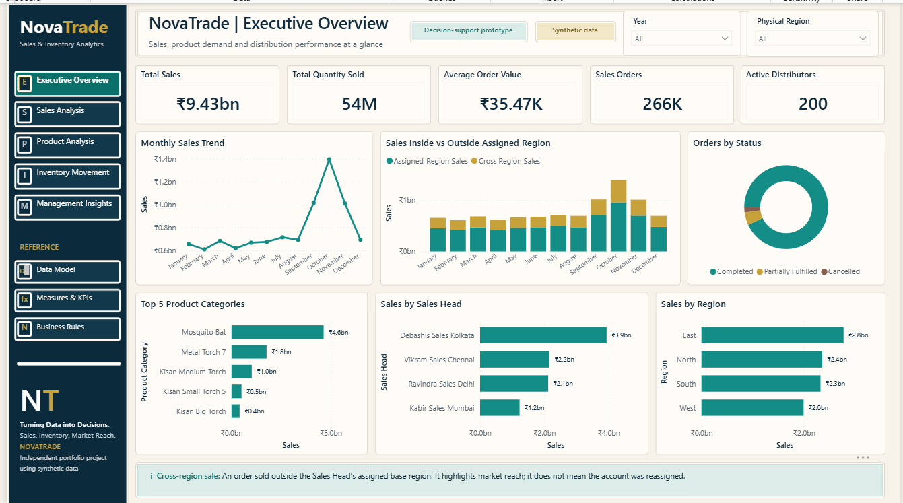
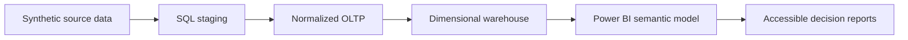

# NovaTrade Sales & Inventory Analytics

NovaTrade is an end-to-end business intelligence portfolio project for a synthetic product-distribution company. It demonstrates the full analytics lifecycle from transactional data and dimensional modeling to an accessible, decision-focused Power BI reporting layer.

> **Data disclosure:** All data and business identities are synthetic and illustrative. NovaTrade is independent and is not affiliated with any real company.

## Executive questions answered

- How much did we sell, and how many units and orders produced that value?
- What is the average value of each sales order?
- How broad is active distributor reach?
- Which products, sales leaders and regions drive performance?
- How much selling occurs outside assigned regions, and when?
- What is the current order-status mix?

## Architecture

## Stage 2 status

The Executive Overview is the approved golden design system for the remaining pages. It includes five aligned KPIs, six analytical visuals, a required single-year Jan–Dec view, slicer-responsive stepped teal ranking tones, contextual tooltips, page navigation, logical keyboard order, descriptive alt text, WCAG-aware contrast and a visible synthetic-data disclosure.

Current page sequence:

1. Executive Overview — Stage 2 complete
2. Sales Analysis — next build
3. Product Analysis — functional shell
4. Inventory Movement — functional shell; reconciliation gate pending
5. Management Insights — functional shell
6. Drillthrough and hidden validation pages — planned finalization

## Technology

- SQL Server: staging, OLTP and dimensional warehouse
- Power BI Project format (PBIP/PBIR) for source control
- TMDL semantic model with a star-schema design
- DAX measures for sales, inventory, time intelligence and management analysis
- Git/GitHub for versioned report source and validation evidence

## Validation evidence

- Microsoft PBIR validation: 0 errors, 0 warnings
- Reproducible Executive checkpoint validation: 0 issues
- Semantic references resolved against the TMDL model
- Navigation targets verified
- Executive visuals checked against the 1440 x 810 canvas
- Five public pages and four hidden support pages verified
- Public data visuals checked for alt text and keyboard order
- NovaTrade-only identity and external-brand separation verified

See [Validation Summary](docs/VALIDATION-SUMMARY.md), [Accessibility QA](docs/ACCESSIBILITY-QA.md) and the [remaining-page build plan](docs/NEXT-PAGE-BUILD-PLAN.md).

## Open the report

1. Clone or download the repository.
2. Open `powerbi/NovaTrade.pbip` in Power BI Desktop.
3. In Desktop edit mode, use **Ctrl + click** for page-navigation buttons.
4. Keep `powerbi/NovaTrade.SemanticModel/.pbi/` out of source control; it is a local cache.

## Next milestone

Stage 3A will complete Sales Analysis: prior-year trend comparison, Sales Head and region drivers, distributor ranking, territory mix, drillthrough, interaction QA and accessibility validation.
