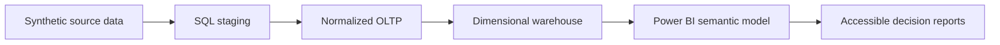

# NovaTrade Sales & Inventory Analytics

NovaTrade is an end-to-end business intelligence portfolio project for a synthetic product-distribution company. It demonstrates the full analytics lifecycle from transactional data and dimensional modeling to an accessible, decision-focused Power BI reporting layer.

> **Data disclosure:** All data and business identities are synthetic and illustrative. NovaTrade is independent and is not affiliated with any real company.

## Business questions answered

- How much did we sell, and how many units and orders produced that value?
- What is the average value of each sales order?
- How broad is active distributor reach?
- Which products, sales leaders and regions drive performance?
- How much selling occurs outside assigned regions, and when?
- What is the current order-status mix?
- Which growing products face replenishment pressure?
- Where is flow-risk revenue concentrated, and who owns the response?
- Which products require demand recovery or management monitoring?

## Architecture

## Reporting-layer status

The five core analytical pages are complete. They use one visual system, shared metric definitions, contextual tooltips, page navigation, logical keyboard order, descriptive alt text, WCAG-aware contrast and a visible synthetic-data disclosure.

Core analytical pages:

1. Executive Overview
2. Sales Performance
3. Product Performance
4. Inventory Operations
5. Management Insights / Management Decision Center

Hidden reference and governance pages:

1. Measures & Validation Center — six filter-aware reconciliation tests
2. Data Model Overview — two-fact star schema, grain and relationship contract
3. Business Logic & Notes — metric definitions, exception rules and source limits

The `00_UI Template` page remains hidden as a design-system support page.

## Technology

- SQL Server: staging, OLTP and dimensional warehouse
- Power BI Project format (PBIP/PBIR) for source control
- TMDL semantic model with a star-schema design
- DAX measures for sales, inventory, time intelligence and management analysis
- Git/GitHub for versioned report source and validation evidence

## Validation evidence

- Microsoft PBIR validation: 0 errors, 0 warnings
- Reproducible checkpoints for all five analytical pages: 0 issues
- Report-governance checkpoint: 0 issues
- Six filter-aware DAX and model-integrity tests
- Semantic references resolved against the TMDL model
- Navigation targets verified
- All completed pages checked against the 1440 x 810 canvas
- Five public pages and four hidden support pages verified
- Public data visuals checked for alt text and keyboard order
- NovaTrade-only identity and external-brand separation verified

See [Validation Summary](docs/VALIDATION-SUMMARY.md), [Accessibility QA](docs/ACCESSIBILITY-QA.md) and [Report Governance Pages](docs/REPORT-GOVERNANCE-PAGES.md).

## Open the report

1. Clone or download the repository.
2. Open `powerbi/NovaTrade.pbip` in Power BI Desktop.
3. In Desktop edit mode, use **Ctrl + click** for page-navigation buttons.
4. Keep `powerbi/NovaTrade.SemanticModel/.pbi/` out of source control; it is a local cache.

## Next milestone

Run one report-wide final-polish and publication pass: KPI naming, display units, spacing, tooltip definitions, interaction QA, accessibility review, screenshots and portfolio/GitHub presentation.
